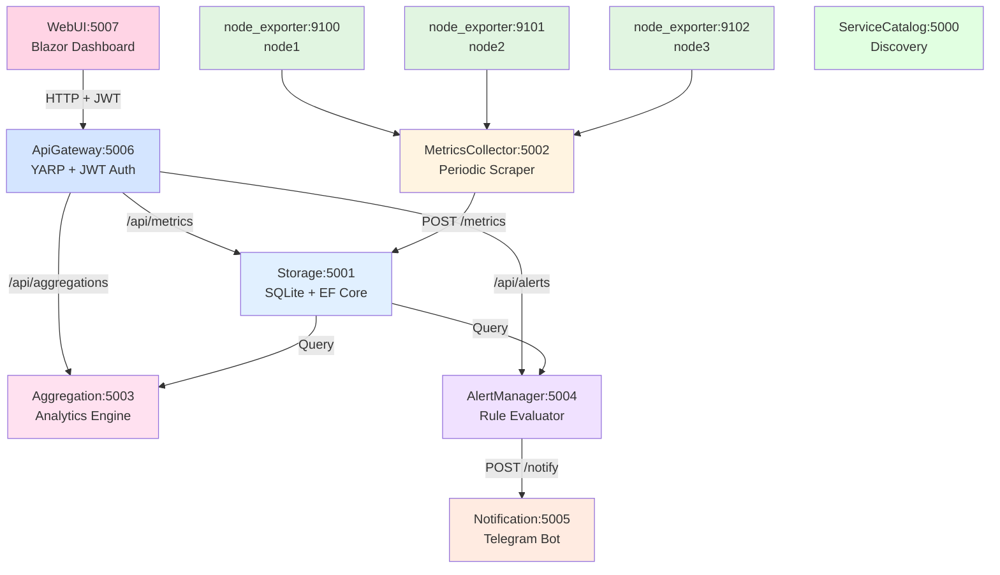

# PacketSpotting - Network Monitoring Microservices System

A distributed network monitoring system demonstrating microservices architecture principles with ASP.NET 9 and C# 13.

> **🚀 Quick Start**: Want to get running immediately? See [QUICKSTART.md](QUICKSTART.md) for a 5-minute setup guide.

## 📋 Overview

**PacketSpotting** collects, stores, aggregates, and alerts on network infrastructure metrics from `node_exporter` instances. The system demonstrates advanced analytics and custom aggregations that extend beyond standard Prometheus deployments.

###  System Features

- **Selective Metric Persistence**: Network-specific metrics with 24-hour retention
- **Advanced Correlation**: Cross-node traffic flow analysis and bidirectional pattern detection
- **Statistical Anomaly Detection**: Z-score based deviation detection (3-sigma threshold)
- **Flexible Alerting**: YAML-based rules with state tracking and Telegram notifications
- **Microservices Architecture**: 7 independent services with clear boundaries

## 🏗️ Architecture



### Service Responsibilities

| Service | Port | Purpose |
|---------|------|---------|
| **ServiceCatalog** | 5000 | HTTP-based service registry for dynamic discovery |
| **Storage** | 5001 | SQLite time-series database with time-bucketed indexing |
| **MetricsCollector** | 5002 | Prometheus parser with 15s scrape interval |
| **Aggregation** | 5003 | Anomaly detection (z-score) + traffic correlation |
| **AlertManager** | 5004 | YAML rule evaluation with state tracking |
| **Notification** | 5005 | Telegram Bot API integration |
| **ApiGateway** | 5006 | YARP reverse proxy with JWT authentication |
| **WebUI** | 5007 | Blazor Server dashboard with real-time monitoring |
| **NodeExporter.Mock** | 9100-9102 | Realistic Prometheus metrics generator |

## 🚀 Quick Start

### Prerequisites

- **.NET 9 SDK** ([Download](https://dotnet.microsoft.com/download/dotnet/9.0))
- **Terminal** with multiple tabs/windows
- **(Optional)** Telegram Bot for notifications
- **Web Browser** for accessing the UI

### Running the System

**Option 1: Run All Services Individually**

Open 9 terminal windows and run each service:

```bash
# Terminal 1: ServiceCatalog
cd ServiceCatalog
dotnet run

# Terminal 2: NodeExporter Mock (node1)
cd NodeExporter.Mock
dotnet run

# Terminal 3: NodeExporter Mock (node2)
cd NodeExporter.Mock
dotnet run --environment node2 appsettings.node2.json

# Terminal 4: Storage
cd Storage
dotnet run

# Terminal 5: MetricsCollector
cd MetricsCollector
dotnet run

# Terminal 6: Aggregation
cd Aggregation
dotnet run

# Terminal 7: AlertManager
cd AlertManager
dotnet run

# Terminal 8: Notification
cd Notification
dotnet run

# Terminal 9: ApiGateway
cd ApiGateway
dotnet run

# Terminal 10: WebUI
cd WebUI
dotnet run
```

**Option 2: Use the Startup Script** (recommended)

```bash
# Make script executable (Linux/macOS)
chmod +x start-all.sh
./start-all.sh

# Windows
start-all.bat
```

### Verifying the System

1. **Access the Web Dashboard**:
```bash
# Open in your browser:
http://localhost:5007

# Login credentials:
Username: admin
Password: PacketSpotting2025!
```

2. **Check Health Endpoints**:
```bash
curl http://localhost:5000/health  # ServiceCatalog
curl http://localhost:5001/health  # Storage
curl http://localhost:5002/health  # MetricsCollector
curl http://localhost:5003/health  # Aggregation
curl http://localhost:5004/health  # AlertManager
curl http://localhost:5005/health  # Notification
curl http://localhost:5006/health  # ApiGateway
```

3. **Test API Gateway Authentication**:
```bash
# Login to get JWT token
curl -X POST http://localhost:5006/auth/login \
  -H "Content-Type: application/json" \
  -d '{"username":"admin","password":"PacketSpotting2025!"}'

# Use token for authenticated requests
TOKEN="<your_token_here>"
curl http://localhost:5006/api/metrics/recent \
  -H "Authorization: Bearer $TOKEN"
```

4. **View Metrics Collection** (direct service access):
```bash
# Check mock node_exporter metrics
curl http://localhost:9100/metrics

# Query recent metrics from Storage
curl http://localhost:5001/metrics/recent
```

5. **Test Aggregations**:
```bash
# Get anomaly detection results
curl http://localhost:5003/aggregations/anomalies

# Get traffic flow correlations
curl http://localhost:5003/aggregations/traffic-flows
```

6. **View Active Alerts**:
```bash
curl http://localhost:5004/alerts/active
```

## 🔧 Configuration

### Alert Rules (AlertManager)

Edit `AlertManager/alert-rules.yaml`:

```yaml
alerts:
  - name: high_network_receive
    metric: node_network_receive_bytes_total
    threshold: 50000000000  # 50 GB
    condition: greater_than
    interval: 30s
    message: "High network receive on {{node}}: {{value}} bytes"
```

### Telegram Notifications

Edit `Notification/appsettings.json`:

```json
{
  "Telegram": {
    "BotToken": "YOUR_BOT_TOKEN",
    "ChatId": "YOUR_CHAT_ID"
  }
}
```

To get credentials:
1. Create bot via [@BotFather](https://t.me/botfather)
2. Get `BotToken` from BotFather
3. Send message to bot and get `ChatId` from `https://api.telegram.org/bot<TOKEN>/getUpdates`

## 💡 Key Features Demonstration

### 1. Anomaly Detection

The system uses statistical z-score analysis to detect anomalies:

```csharp
// Z-score calculation (3-sigma threshold)
var zScore = (currentValue - baselineMean) / baselineStdDev;
if (zScore > 3.0) {
    // Anomaly detected!
}
```

**Value Proposition**: Unlike Prometheus, this provides stateful analysis across time windows with customizable algorithms.

### 2. Traffic Correlation

Analyzes bidirectional traffic patterns:

```csharp
// Correlates transmit from Node A with receive on Node B
var correlation = AnalyzeTrafficFlow(sourceNode, destNode, timeWindow);
```

**Value Proposition**: Cross-node analysis not easily expressible in PromQL.

### 3. Custom Retention

Time-bucketed storage (YYYYMMDDHH) with automatic 24-hour cleanup:

```csharp
public int TimeBucket => timestamp.Year * 1000000 +
                         timestamp.Month * 10000 +
                         timestamp.Day * 100 +
                         timestamp.Hour;
```

**Value Proposition**: Selective persistence of network metrics only.

## 📚 API Endpoints

### Storage Service (5001)
- `POST /metrics` - Store metrics
- `POST /metrics/query` - Query with filters
- `GET /metrics/recent?nodeName=node1&limit=100` - Recent metrics

### Aggregation Service (5003)
- `GET /aggregations/anomalies` - Get anomaly detections
- `GET /aggregations/traffic-flows` - Get traffic correlations
- `POST /aggregations/compute` - Custom aggregation request

### AlertManager (5004)
- `GET /alerts/active` - List firing alerts
- `POST /alerts/reload-rules` - Reload YAML rules

### Notification (5005)
- `POST /notify` - Send notification

## 🔬 Testing

### Manual Testing

```bash
# 1. Generate traffic by hitting mock exporters
for i in {1..100}; do curl -s http://localhost:9100/metrics > /dev/null; done

# 2. Wait 30 seconds for collection

# 3. Check stored metrics
curl http://localhost:5001/metrics/recent | jq '.metrics | length'

# 4. Trigger aggregations
curl http://localhost:5003/aggregations/anomalies | jq '.anomalies'

# 5. Check alerts
curl http://localhost:5004/alerts/active | jq '.alerts'
```

### Load Testing

```bash
# Stress test the collection pipeline
while true; do
  curl -s http://localhost:9100/metrics &
  curl -s http://localhost:9101/metrics &
  curl -s http://localhost:9102/metrics &
  sleep 1
done
```

## 🏛️ Technology Stack

| Component | Technology | Justification |
|-----------|------------|---------------|
| **Framework** | ASP.NET 9 | Modern minimal APIs, native performance |
| **Language** | C# 13 | Records, pattern matching, required members |
| **Database** | SQLite + EF Core | Embedded, zero-config, sufficient for time-series |
| **Scheduling** | PeriodicTimer | Built-in .NET, no external dependencies |
| **Parsing** | Regex Source Generators | Compile-time optimization |
| **Serialization** | System.Text.Json | High performance, modern .NET standard |
| **Configuration** | YAML (YamlDotNet) | Human-readable alert rules |

## 📖 Design Decisions

See [DESIGN.md](DESIGN.md) for detailed justifications on:
- Why microservices over monolith
- Communication protocol choices (REST vs gRPC)
- Storage design trade-offs
- Aggregation value proposition

## 🎓 Learning Outcomes

This implementation demonstrates:

1. **Microservices Patterns**:
   - Service discovery and registration
   - API-based communication
   - Independent deployment units

2. **Modern .NET Practices**:
   - Minimal APIs
   - Background services (IHostedService)
   - Dependency injection
   - Configuration patterns

3. **Distributed System Concerns**:
   - Service resilience
   - Graceful degradation
   - Structured logging
   - State management

4. **Domain-Driven Design**:
   - Clear bounded contexts
   - Service autonomy
   - Event-driven communication

## 📝 Project Structure

```
project02/
├── ServiceCatalog/          # HTTP service registry
├── NodeExporter.Mock/       # Prometheus metrics generator
├── MetricsCollector/        # Periodic scraper
├── Storage/                 # SQLite persistence
├── Aggregation/             # Analytics engine
├── AlertManager/            # Rule evaluator
├── Notification/            # Telegram integration
├── ApiGateway/              # YARP reverse proxy + JWT auth
├── WebUI/                   # Blazor Server dashboard
├── Shared.Contracts/        # DTOs and interfaces
├── README.md                # This file
├── DESIGN.md                # Design justification
└── start-all.sh             # Automated startup script
```

## 🔐 ApiGateway Features

The ApiGateway provides centralized authentication and routing:

**Authentication**:
- JWT Bearer token authentication
- API key authentication (X-API-Key header)
- Configurable users and keys in appsettings.json

**Routing**:
- `/auth/login` - Get JWT token
- `/auth/validate` - Validate token
- `/api/metrics/*` → Storage:5001
- `/api/aggregations/*` → Aggregation:5003
- `/api/alerts/*` → AlertManager:5004

**CORS**: Configured for WebUI origin (localhost:5007)

## 🖥️ WebUI Features

Blazor Server dashboard with real-time monitoring:

**Authentication**:
- Login page with session management
- JWT token storage in browser session
- Protected routes with authorization

**Dashboard**:
- **Live Metrics Table**: Real-time node bandwidth and drops
- **Bandwidth Data Table**: Last 20 data points with timestamps
- **Active Alerts Panel**: Firing alerts with severity indicators
- **Anomaly Detection**: Z-score based anomalies
- **Traffic Flows**: Top node-to-node traffic correlations
- **Auto-refresh**: 10-second update interval

## 🤝 Contributing

This is a reference implementation for educational purposes. Key areas for enhancement:
- [ ] Add distributed tracing (OpenTelemetry)
- [ ] Implement circuit breakers (Polly)
- [ ] Add comprehensive unit/integration tests
- [x] ~~Create Docker Compose for orchestration~~ ✅ **Implemented**
- [ ] Implement gRPC for high-throughput communication

---

## 🔄 CI/CD & Kubernetes Deployment

PacketSpotting includes a complete CI/CD pipeline with GitOps automation, Docker multi-arch builds, and production-ready Helm charts for Kubernetes deployment.

### CI/CD Features

- ✅ **Automated Build & Test** - GitHub Actions workflows for all services
- ✅ **Semantic Versioning** - GitVersion with conventional commits
- ✅ **Multi-Architecture** - Docker images for AMD64 and ARM64
- ✅ **Security Hardened** - Non-root containers, read-only filesystems, Checkov scanning
- ✅ **GitOps** - Automated Helm chart updates on service releases
- ✅ **Comprehensive Testing** - Unit tests, smoke tests, Helm tests on kind cluster
- ✅ **Istio Ready** - Service mesh integration with proper labels and named ports

### Quick Start - Docker Compose

Run the entire system with Docker Compose:

```bash
# Pull latest images
docker compose pull

# Start all services
docker compose up -d

# Check status
docker compose ps

# View logs
docker compose logs -f

# Access WebUI
open http://localhost:5007

# Cleanup
docker compose down -v
```

### Quick Start - Kubernetes

Deploy to Kubernetes with Helm:

```bash
# Add Helm repository
helm repo add packetspotting oci://ghcr.io/unnecessary-microservices/helm-charts
helm repo update

# Install with Istio
helm repo add istio https://istio-release.storage.googleapis.com/charts
helm install istio-base istio/base -n istio-system --create-namespace --wait
helm install istiod istio/istiod -n istio-system --wait

# Install PacketSpotting
helm install packetspotting packetspotting/packetspotting \
  --namespace packetspotting \
  --create-namespace \
  --wait \
  --set notification.secrets.telegram.botToken="YOUR_BOT_TOKEN" \
  --set notification.secrets.telegram.chatId="YOUR_CHAT_ID"

# Check status
kubectl get pods -n packetspotting
helm test packetspotting -n packetspotting

# Access services (with port-forward)
kubectl port-forward -n prod-webui svc/webui 5007:8080
```

### Local Testing with kind

Test the complete Kubernetes deployment locally:

```bash
# Create kind cluster
kind create cluster --name packetspotting-test

# Install Istio
helm repo add istio https://istio-release.storage.googleapis.com/charts
helm install istio-base istio/base -n istio-system --create-namespace --wait
helm install istiod istio/istiod -n istio-system --wait

# Install PacketSpotting from local chart
helm install packetspotting ./helm/packetspotting \
  -n packetspotting \
  --create-namespace \
  --wait \
  --set global.namespacePrefix="" \
  --set notification.secrets.telegram.botToken="test-token" \
  --set notification.secrets.telegram.chatId="test-id"

# Verify deployment
kubectl get pods --all-namespaces
helm test packetspotting -n packetspotting

# Cleanup
kind delete cluster --name packetspotting-test
```

### Configuration Options

The Helm chart supports extensive customization via `values.yaml`:

```yaml
# Disable specific services
alertmanager:
  enabled: false

# Scale services
aggregation:
  replicaCount: 3
  autoscaling:
    enabled: true
    minReplicas: 2
    maxReplicas: 10
    targetCPUUtilizationPercentage: 75

# Change namespace prefix
global:
  namespacePrefix: "staging"  # Creates staging-storage, staging-aggregation, etc.

# Configure resources
storage:
  resources:
    requests:
      cpu: 500m
      memory: 1Gi
    limits:
      cpu: 2000m
      memory: 2Gi

# Set specific image versions
storage:
  image:
    tag: "1.2.3"

# Configure Telegram notifications
notification:
  secrets:
    telegram:
      botToken: "your-bot-token"
      chatId: "your-chat-id"

# Configure NodeExporter instances
nodeexporter:
  instances: 5  # Deploy 5 mock exporters
  proxyToRealExporter: true
  realExporterUrl: "http://real-node-exporter:9100"

# Istio configuration
istio:
  enabled: true
  ingressGateway: istio-system/istio-ingressgateway

apigateway:
  istio:
    enabled: true
    hosts:
      - "packetspotting.example.com"

webui:
  istio:
    enabled: true
    hosts:
      - "packetspotting-ui.example.com"
```

### CI/CD Architecture

```
Service Repos → GitHub Actions → Build & Test → Docker Build (multi-arch) → Push to ghcr.io
                                       ↓
                                  Trigger Deployment Repo
                                       ↓
                           Update Helm Chart (values.yaml)
                                       ↓
                    Helm Workflow (lint, test, publish)
                                       ↓
                            Push Chart to ghcr.io
                                       ↓
                    Ready for Kubernetes Deployment
```

### Development Workflow

1. **Make Changes** to service code
2. **Push to main** branch in service repository
3. **CI Pipeline** automatically:
   - Builds and tests the service
   - Generates semantic version (e.g., v1.2.3)
   - Builds multi-arch Docker image
   - Publishes to ghcr.io
   - Triggers Deployment repo update
4. **Helm Chart** automatically:
   - Updates image tag in values.yaml
   - Bumps chart version
   - Runs security scan and tests
   - Publishes updated chart
5. **Deploy** updated chart to Kubernetes

### Monitoring & Health Checks

All services expose health endpoints:

```bash
# Kubernetes health checks
kubectl get pods -n prod-storage  # Check pod status

# Manual health checks (via port-forward)
kubectl port-forward -n prod-storage svc/storage 8080:8080
curl http://localhost:8080/health
```

The Helm chart includes:
- **Liveness probes** - Restart unhealthy pods
- **Readiness probes** - Control traffic routing
- **Helm tests** - Automated health verification

### Security Features

- **Non-root containers** - All services run as user 1000
- **Read-only root filesystem** - Prevents tampering
- **Security scanning** - Checkov validates manifests
- **Minimal images** - Alpine-based for reduced attack surface
- **Secrets management** - Kubernetes secrets for sensitive data
- **Network policies** - Namespace isolation
- **Service mesh** - Istio for mTLS and traffic management

### Scaling

```bash
# Manual scaling
kubectl scale deployment storage -n prod-storage --replicas=3

# Horizontal Pod Autoscaler (HPA)
# Automatically scales based on CPU/memory
kubectl get hpa -n prod-aggregation

# Update HPA configuration
helm upgrade packetspotting ./helm/packetspotting \
  --set aggregation.autoscaling.maxReplicas=20 \
  --reuse-values
```

### Troubleshooting

```bash
# Check pod status
kubectl get pods -n prod-storage

# View logs
kubectl logs -n prod-storage deployment/storage --tail=100 -f

# Describe pod for events
kubectl describe pod -n prod-storage <pod-name>

# Check services
kubectl get svc -n prod-storage

# Test connectivity
kubectl run -it --rm debug --image=busybox --restart=Never -- \
  wget -O- http://storage.prod-storage.svc.cluster.local:8080/health

# Helm status
helm status packetspotting -n packetspotting

# Run Helm tests
helm test packetspotting -n packetspotting --logs
```

### Documentation

Detailed CI/CD documentation:

- **[QUICK_START_CICD.md](QUICK_START_CICD.md)** - Quick start guide for CI/CD
- **[CICD_IMPLEMENTATION_GUIDE.md](CICD_IMPLEMENTATION_GUIDE.md)** - Detailed implementation guide
- **[CICD_SUMMARY.md](CICD_SUMMARY.md)** - Executive summary and architecture
- **[CICD_FINAL_STATUS.md](CICD_FINAL_STATUS.md)** - Final status and deployment instructions

### Production Checklist

Before deploying to production:

- [ ] Configure proper resource limits
- [ ] Set up persistent storage (not emptyDir)
- [ ] Configure real Telegram credentials
- [ ] Set up monitoring (Prometheus, Grafana)
- [ ] Configure Istio ingress with real domain names
- [ ] Set up TLS certificates
- [ ] Configure log aggregation
- [ ] Set up backup strategy for Storage service
- [ ] Configure alerting rules
- [ ] Perform load testing
- [ ] Set up disaster recovery plan
- [ ] Document runbook for common issues

### Container Images

All images published to: `ghcr.io/unnecessary-microservices/{service}:version`

- Multi-architecture: amd64, arm64
- Based on .NET 9 Alpine
- Security hardened
- Semantic versioned
- Immutable tags

### Helm Chart

Published to: `ghcr.io/unnecessary-microservices/helm-charts/packetspotting`

- **46 Kubernetes manifests** generated
- All 10 services configurable
- Istio integration
- Security-first design
- Production-ready defaults

---

## 📄 License

Educational project - MIT License

## 🙏 Acknowledgments

Built with ❤️ using .NET 9, demonstrating microservices architecture for network monitoring.

---

**Generated as reference implementation for microservices course assignment.**
